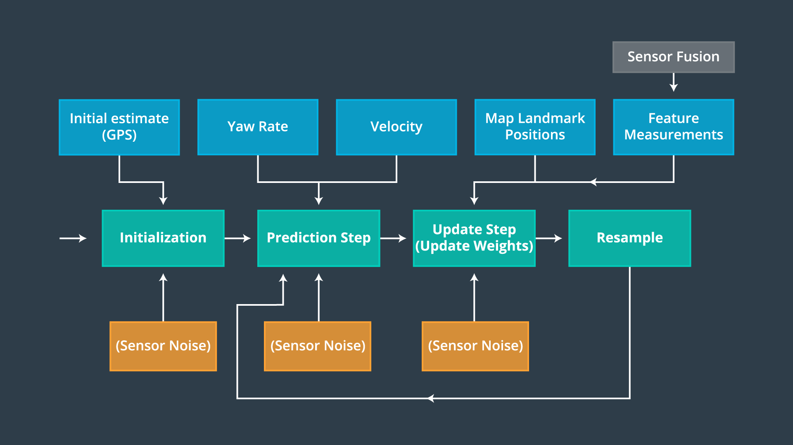
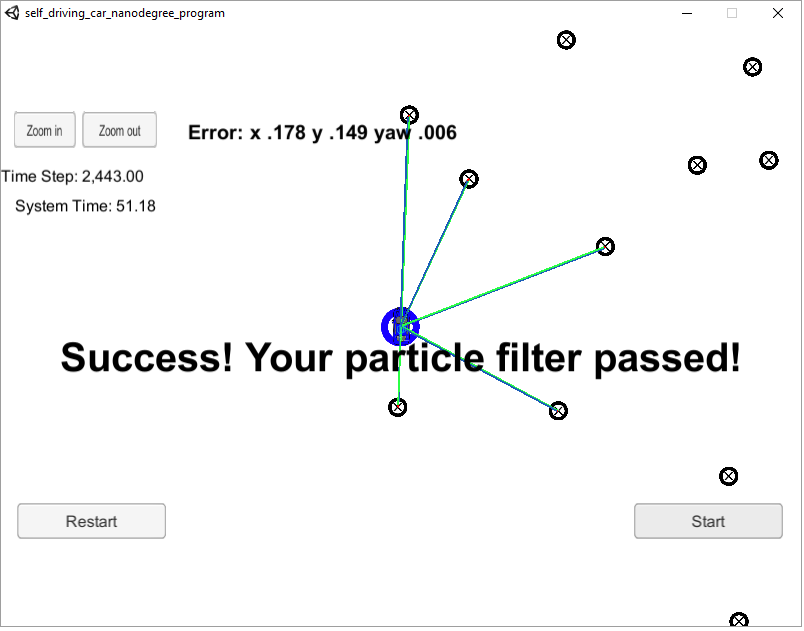
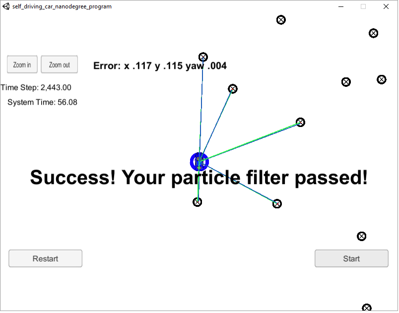
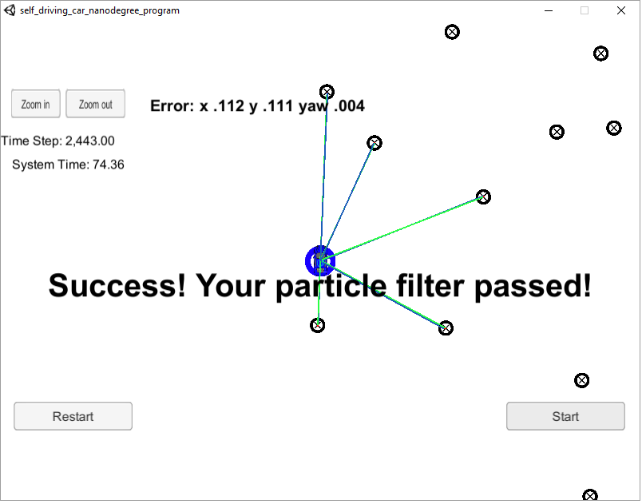

# Kidnapped Vehicle Project - Using Particle  Filter

Author : Manoj Kumar Subramanian

------

## Overview

This repository is as part of my Submission to the Project 3: Kidnapped Vehicle Project using Particle Filter for the Udacity Self Driving Car Nano Degree Program Term 2. 

**Project background:** A robot has been kidnapped and transported to a new location! Luckily it has a map of this location, a (noisy) GPS estimate of its initial location, and lots of (noisy) sensor and control data. The goal is to localize the robot's location based on the initial estimate and the observations it makes from the environment.

In this project, a 2 dimensional particle filter is realized in C++ to estimate the location of a moving object (a kidnapped vehicle). The particle filter is given a map and some initial localization information (analogous to what a GPS would provide). At each time step the filter also gets observation and control data (the vehicle speed and yaw rate measurements). This project involves the Term 2 Simulator.

------

## Project Goals

The goals of this project are the following:

- To build out the methods in `particle_filter.cpp` until the simulator output says:

  ```
  Success! Your particle filter passed!
  ```

The simulator consists of a vehicle running through an environment with changes in location and orientations. This takes about 2443 time steps and within these time steps, the error between the estimated location and the ground truth location should be minimal. Also, the simulations should get completed within 100 seconds of the system time.

For this, the code should get compiled without any errors with the following methods to be implemented in `particle_filter.cpp` with the total number of particles used to an optimal value so that the code utilizes optimal resources.

```c++
void init(double x, double y, double theta, double std[]);

void prediction(double delta_t, double std_pos[], double velocity, double yaw_rate);

void dataAssociation(std::vector<LandmarkObs> predicted, std::vector<LandmarkObs>& observations);

void updateWeights(double sensor_range, double std_landmark[], const std::vector<LandmarkObs> &observations,const Map &map_landmarks);
```


------

## Inputs to the Particle Filter

You can find the inputs to the particle filter in the `data` directory. 

#### The Map*

`map_data.txt` includes the position of landmarks (in meters) on an arbitrary Cartesian coordinate system. Each row has three columns

- x position
- y position
- landmark id
- Note: Map data provided by 3D Mapping Solutions GmbH.

#### All other data the simulator provides, such as observations and controls.

#### Websocket Protocol

Here is the main protocol that main.cpp uses for uWebSocketIO in communicating with the simulator.

**INPUT**: 

Values provided by the simulator to the c++ program

```
// sense noisy position data from the simulator
sense_x
sense_y
sense_theta
```

```
// get the previous velocity and yaw rate to predict the particle's transitioned state
previous_velocity
previous_yawrate
```

```
// receive noisy observation data from the simulator, in a respective list of x/y values
sense_observations_x
sense_observations_y
```

**OUTPUT**: 

Values provided by the c++ program to the simulator

```
// best particle values used for calculating the error evaluation
best_particle_x
best_particle_y
best_particle_theta
```

```
//Optional message data used for debugging particle's sensing and associations
// for respective (x,y) sensed positions ID label 
best_particle_associations
// for respective (x,y) sensed positions
best_particle_sense_x 		//list of sensed x positions
best_particle_sense_y	 	//list of sensed y positions
```

# Implementing the Particle Filter
The Particle Filter implementation has 4 major steps:

1. Initialization
2. Prediction
3. Update Weights and
4. Resample

Below picture gives a high level of the steps involved and the inputs required for each step for this project.



#### **Step 1:** Initialization

The total number of particles to be used were set and the initial GPS co-ordinates with the x, y, theta values from the GPS were used with the addition of the Gaussian distribution noise for each of the particles.

#### **Step 2: Prediction**

The Yaw Rate and Velocity were taken as inputs from the control section. The formula to calculate the next step of x, y, theta positions for each particle were added with the velocity and yaw rate obtained from the simulator. The sensor's noise were added.

#### **Step 3: Update Weights**

The update step itself contains multiple sub steps to achieve the functionality.

For each particle:

1. The Landmarks obtained from the map that are nearest to the current particles location were filtered and kept in a vector.
2. All the observations made by the vehicle sensors were converted from the vehicle co-ordinates to the map co-ordinates.
3. For each of the observation, the best Landmark association is performed using the nearest neighbor approach.
4. Finally , the probability density for each of the observations associated landmarks using the Multivariate Gaussian probability density formula is calculated and the weights were updated.

#### **Step 4: Resampling**

The discrete distribution function is used to merge out the particles with higher weights. The steps 2, 3 and 4 were repeated to come up with a good estimate of the kidnapped vehicle.

------

### **Project Outputs:**

Below were the screenshots of the project output when run with different number of particles.

| Number of Particles | Simulator Outpu                          |
| ------------------- | ---------------------------------------- |
| 10                  |  |
| 50                  |  |
| 100                 |  |

With the number of particles increased to 300, the system ran out of time though there is a minor improvement in the Error.

Conclusion: For this project, the number of particles used as 50 shall be an optimum solution finishing the 2443 time steps in about 56 seconds of system time and having reduced error values.

------

## Running the Code

This project involves the Term 2 Simulator which can be downloaded [here](https://github.com/udacity/self-driving-car-sim/releases)

This repository includes two files that can be used to set up and intall uWebSocketIO for either Linux or Mac systems. For windows you can use either Docker, VMware, or even Windows 10 Bash on Ubuntu to install uWebSocketIO.

Once the install for uWebSocketIO is complete, the main program can be built and ran by doing the following from the project top directory.

1. mkdir build
2. cd build
3. cmake ..
4. make
5. ./particle_filter

Alternatively some scripts have been included to streamline this process, these can be leveraged by executing the following in the top directory of the project:

1. ./clean.sh
2. ./build.sh
3. ./run.sh

Tips for setting up your environment can be found [here](https://classroom.udacity.com/nanodegrees/nd013/parts/40f38239-66b6-46ec-ae68-03afd8a601c8/modules/0949fca6-b379-42af-a919-ee50aa304e6a/lessons/f758c44c-5e40-4e01-93b5-1a82aa4e044f/concepts/23d376c7-0195-4276-bdf0-e02f1f3c665d)


